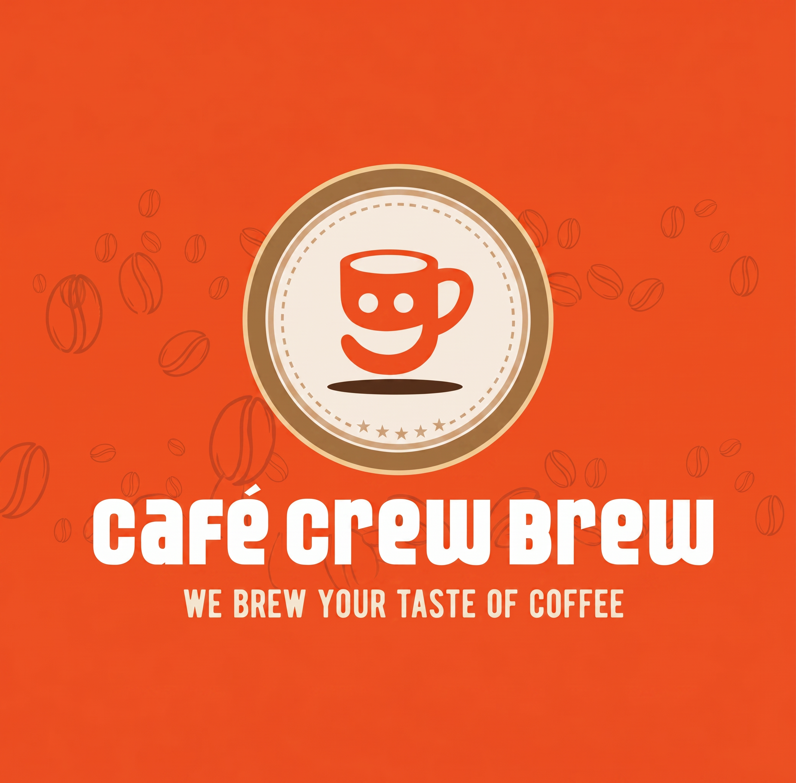

<div align="center">



# Cafe Crew Brew

**A production-grade cafe website built for a real Delhi business — not a demo.**

[](https://cafe-crew-brew.vercel.app/)
[](https://react.dev)
[](https://vite.dev)
[](https://www.framer.com/motion/)
[](https://vercel.com)

</div>

---

## What This Is

Cafe Crew Brew is a real café at Netaji Subhash Place, Delhi. They had no digital presence worth visiting. This is the fix.

Built as part of the Future Interns Full Stack Web Development internship (Task 3 — Build, Pitch & Monetize), but designed and shipped like a real client deliverable — not a portfolio checkbox.

> **Live at → [cafe-crew-brew.vercel.app](https://cafe-crew-brew.vercel.app/)**

---

## The Problem It Solves

Most local cafés lose walk-ins because their online presence is either non-existent or embarrassing. Cafe Crew Brew is open till **2:00 AM** — but nobody outside their regulars knew that.

The website solves three real business problems:

- **Discovery** — SEO-optimized meta tags, Open Graph previews, and Google Maps embed so customers can actually find them
- **Trust** — A premium visual identity that signals quality before someone even walks in
- **Conversion** — Clear CTAs for calls, WhatsApp, and directions, reducing friction to visit

---

## Pages & Sections

| Section | What It Does |
|---|---|
| **Hero** | Full-viewport opener with animated headline and CTA |
| **Marquee** | Scrolling brand tagline strip — energy + motion |
| **About** | Story, vibe, and brand identity |
| **Menu** | Curated offerings with categories and visual hierarchy |
| **Gallery** | Ambience shots — sells the experience |
| **Reviews** | Social proof from real customers |
| **Visit** | Address, hours, live "Open Now" badge, Google Maps embed, WhatsApp + call buttons |
| **Footer** | Full links, contact, branding |

---

## Tech Stack

```
React 19          — UI layer
Vite 6            — Build tool (sub-second HMR)
Framer Motion     — Page-level and scroll-triggered animations
Tailwind CSS v4   — Utility styling
EmailJS           — Contact/reservation form (no backend needed)
Vercel            — Deployment + CDN
```

---

## Design System

The entire UI is built on a custom CSS variable system — no third-party UI library.

```css
--color-bean:     #2C1810   /* Deep espresso — primary dark */
--color-caramel:  #D4A574   /* Warm gold — accents & highlights */
--color-cream:    #FDF6EC   /* Off-white — section backgrounds */
--color-latte:    #C49A6C   /* Mid tone — secondary text */
```

Typography pairs a serif italic display face with a clean body — intentional contrast that reflects the café's dual identity: classic craft, modern energy.

---

## Animations

Every section uses **scroll-triggered entrance animations** via `framer-motion`'s `useInView` hook — elements animate in once, with staggered delays for a layered reveal effect. No jank, no layout shift.

Key motion choices:
- Staggered card entrances on the menu and info grids
- Smooth fade + translate on all section headers
- Live "Open Now" pulse badge on the hours card
- Animated path draw on the reservation success state

---

## Running Locally

```bash
git clone https://github.com/DarshilKh/FUTURE_FS_03.git
cd FUTURE_FS_03
npm install
npm run dev
```

Open `http://localhost:5173`

### Environment Variables (optional — for contact form)

Create a `.env` file in the root:

```env
VITE_EMAILJS_SERVICE_ID=your_service_id
VITE_EMAILJS_TEMPLATE_ID=your_template_id
VITE_EMAILJS_PUBLIC_KEY=your_public_key
VITE_EMAILJS_TO_EMAIL=your_email
```

Without these, the site runs fully — the form simply directs users to call instead.

---

## Project Structure

```
src/
├── components/
│   ├── Navbar.jsx
│   ├── Hero.jsx
│   ├── Marquee.jsx
│   ├── About.jsx
│   ├── Menu.jsx
│   ├── Gallery.jsx
│   ├── Reviews.jsx
│   ├── Visit.jsx
│   └── Footer.jsx
├── App.jsx
├── main.jsx
└── index.css       ← design tokens, global styles, utility classes
public/
└── [images, icons, logo]
```

---

## Internship Context

**Program:** Future Interns — Full Stack Web Development  
**Task:** #3 — Build, Pitch & Monetize a Real Local Business Website  
**Business:** Cafe Crew Brew, PP Tower, NSP Delhi  

The task requirement was to build a real website for a real business and present it as a live pitch. This repo is that deliverable.

---

## Author

**Darshil Khandelwal**  
[](https://linkedin.com/in/darshilkh)
[](https://github.com/DarshilKh)

---

<div align="center">
  <sub>Built with intention. Deployed with care. ☕</sub>
</div>
